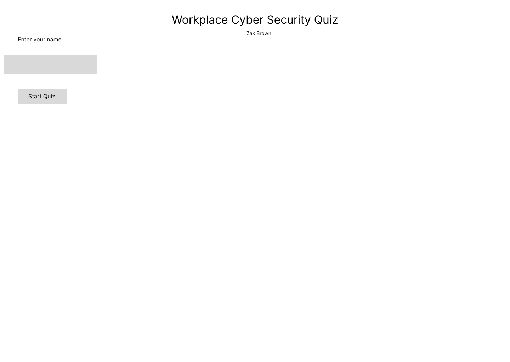
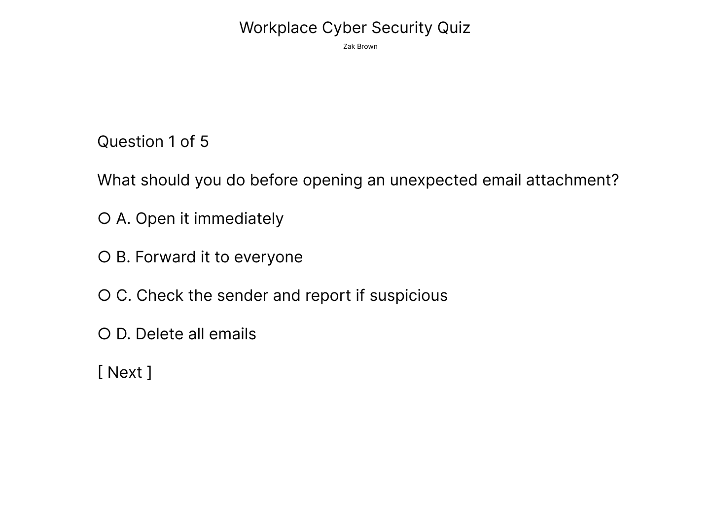
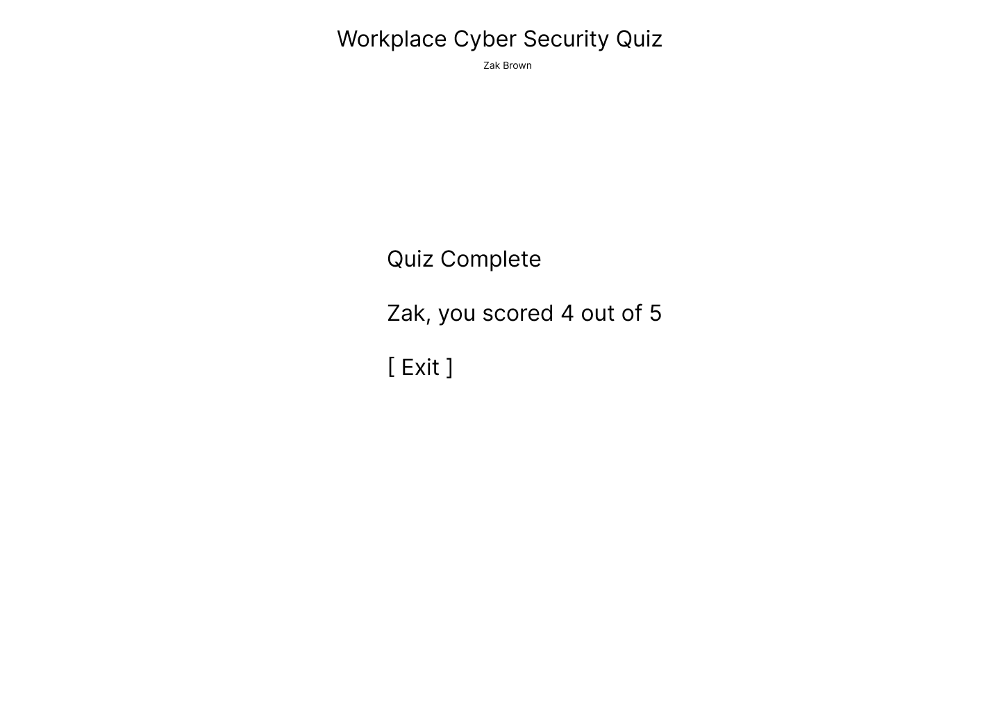
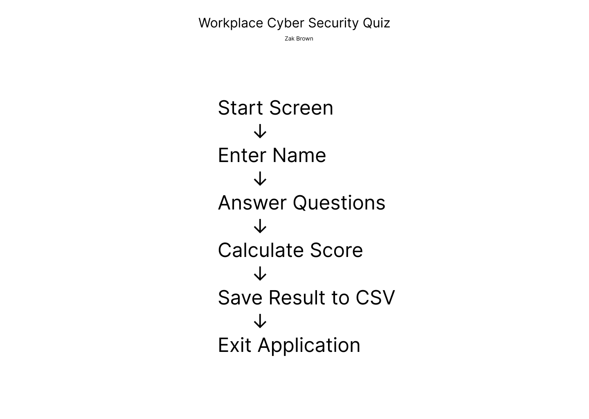
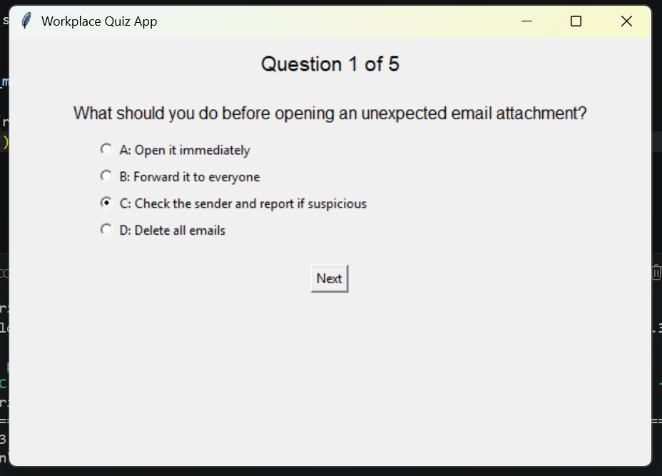
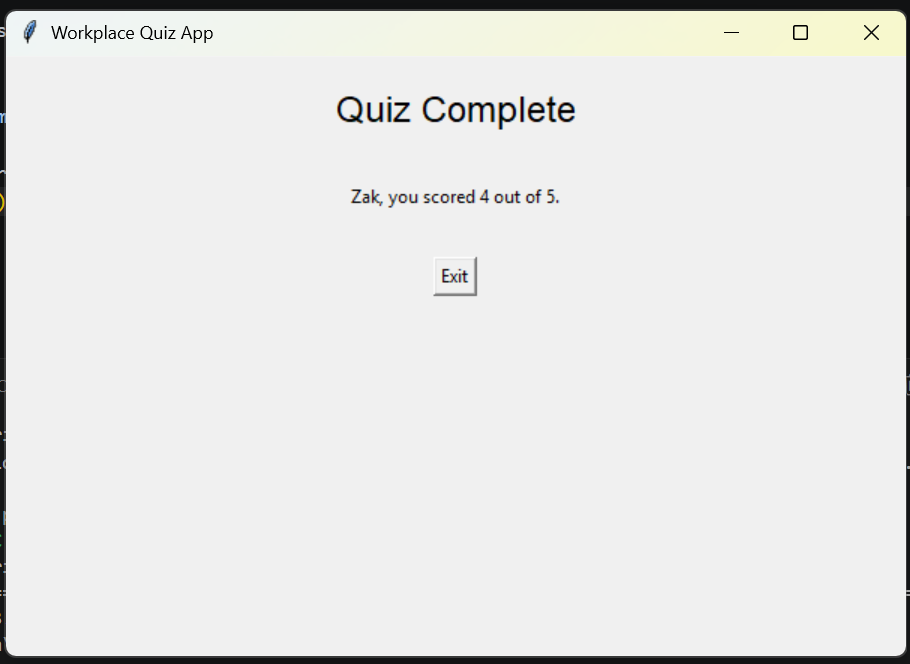
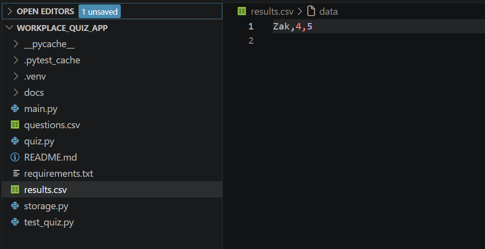
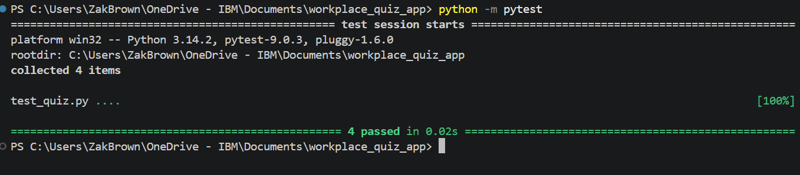
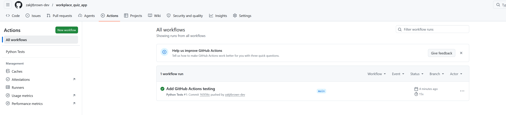

# Workplace Cyber Security Quiz Application

## 1. Introduction

## 2. Design Section

### 2.1 GUI Design

The (GUI) was designed in Figma before development commenced. The objective was to create a simple and intuitive application that could be used by workplace staff with minimal technical knowledge.

The application consists of three main screens:

- A Start Screen where users enter their name before beginning the quiz.
- A Question Screen where users answer multiple-choice questions.
- A Result Screen where users receive their final score.

#### Start Screen



The Start Screen allows users to enter their name and begin the quiz.

#### Question Screen



The Question Screen presents questions and answer options in a clear format using radio button selections.

#### Result Screen



The Result Screen displays the user's final score after completing all questions.

### 2.2 User Journey

The user journey was designed to be simple and efficient. Users enter their name, answer quiz questions, receive a score, and have their results automatically saved to a CSV file.



### 2.3 Functional Requirements

| ID | Requirement |
|----|-------------|
| FR1 | The user shall be able to enter their name. |
| FR2 | The user shall be able to start the quiz. |
| FR3 | The user shall be able to answer multiple-choice questions. |
| FR4 | The application shall calculate a final score. |
| FR5 | The application shall display the final score. |
| FR6 | The application shall save results to a CSV file. |
| FR7 | The application shall validate user inputs. |

### 2.4 Non-Functional Requirements

| ID | Requirement |
|----|-------------|
| NFR1 | The application should be easy to use. |
| NFR2 | The application should run on Python 3.9 or above. |
| NFR3 | The application should provide fast response times. |
| NFR4 | Data should be stored persistently using CSV files. |
| NFR5 | The application should be maintainable and documented. |
| NFR6 | The application should be testable using automated unit tests. |

### 2.5 Tech Stack

| Component | Technology |
|------------|------------|
| Programming Language | Python |
| GUI Framework | Tkinter |
| Data Storage | CSV |
| Testing Framework | Pytest |
| Version Control | Git |
| Repository Hosting | GitHub |
| Continuous Integration | GitHub Actions |
| Design Tool | Figma |

### 2.6 Code Design

The application was developed using object-oriented programming principles.

Three primary classes were used:

- Question
- Quiz
- QuizApp

The Question class stores individual question information.

The Quiz class manages questions, user answers, and score calculation.

The QuizApp class controls the graphical user interface and overall application flow.


## 3. Development Section
The Workplace Cyber Security Quiz was developed using Python 3.14 and the Tkinter GUI framework. The objective of the project was to create a simple but functional workplace training application that could be used to assess staff knowledge on cyber security topics. Throughout development, I focused on creating an application that satisfied all of the MVP requirements while demonstrating object-oriented programming, data persistence, testing, validation and documentation.

The project was developed incrementally using Git and GitHub. Functionality was added in stages, beginning with the core quiz logic, followed by data storage, the graphical user interface, validation, testing and finally continuous integration using GitHub Actions.

### Application Structure

To improve maintainability and readability, the application was separated into three main modules:

| File | Purpose |
|--------|---------|
| `main.py` | Controls the graphical user interface and application flow |
| `quiz.py` | Contains the quiz logic, validation functions and classes |
| `storage.py` | Handles reading and writing data to CSV files |

This separation of concerns ensures that each module is responsible for a specific area of functionality and makes the application easier to maintain and extend.

### Object-Oriented Design

The application was developed using object-oriented programming principles. Three primary classes were created:

#### Question Class

The `Question` class stores information about an individual quiz question, including the question text, available answer options and the correct answer.

```python
class Question:

    def __init__(self, question, options, correct_answer):
        self.question = question
        self.options = options
        self.correct_answer = correct_answer.upper()
```

Using a dedicated Question class allows quiz data to be stored as reusable objects rather than individual variables.

#### Quiz Class

The `Quiz` class manages user responses and score calculation.

```python
class Quiz:

    def __init__(self, questions):
        self.questions = questions
        self.user_answers = []

    def add_answer(self, answer):
        self.user_answers.append(answer.upper())
```

This class is responsible for storing answers provided by the user throughout the quiz.

The final score is calculated using the `calculate_score()` method.

```python
def calculate_score(self):

    score = 0

    for index, question in enumerate(self.questions):

        if self.user_answers[index] == question.correct_answer:
            score += 1

    return score
```

Separating the scoring functionality into its own class improves code organisation and supports future enhancements.

### Input Validation

Input validation was implemented to ensure users provide valid information before progressing through the application.

For example, users must enter a name before the quiz can begin.

```python
def validate_name(name):
    return len(name.strip()) > 0
```

Answer validation was also implemented to ensure only valid responses are accepted.

```python
def validate_answer(answer):
    return answer.upper() in ["A", "B", "C", "D"]
```

These functions are pure functions because they always return the same output when provided with the same input. This makes them straightforward to test using automated unit tests.

### Data Storage

The assessment brief required persistent data storage. To satisfy this requirement, CSV files were used.

The application loads questions from a CSV file when the quiz starts.

```python
questions = load_questions("questions.csv")
```

A separate CSV file is used to store completed quiz results.

```python
save_result("results.csv", self.name.get(), score, total)
```

Using CSV files provided a lightweight solution that avoided the complexity of implementing a database while still meeting the requirement for permanent data storage.

### Exception Handling

Exception handling was implemented within the storage module to prevent application failures when reading and writing files.

```python
try:

    with open(filename, "r", newline="", encoding="utf-8") as file:
        reader = csv.DictReader(file)

except FileNotFoundError:
    print("Question file not found.")
```

This ensures the application can handle unexpected situations gracefully and improves overall robustness.

### Graphical User Interface

Tkinter was selected as the GUI framework because it is included with Python and is suitable for lightweight desktop applications.

The interface consists of three primary screens:

- Start Screen
- Question Screen
- Result Screen

The `QuizApp` class manages navigation between these screens and controls user interaction throughout the application.

The Start Screen allows users to enter their name before beginning the quiz.

The Question Screen displays one question at a time and allows users to select an answer using radio buttons.

The Result Screen displays the user's final score and confirms that the result has been saved.

### Application Workflow

The final application follows the workflow below:

1. User launches the application.
2. User enters their name.
3. Questions are loaded from the CSV file.
4. User answers each question.
5. Answers are validated and stored.
6. The final score is calculated.
7. Results are written to the CSV file.
8. The final score is displayed to the user.

This workflow ensures a simple and intuitive experience while satisfying all functional requirements identified during the design phase.
## 4. Testing Section
Testing was carried out throughout the development lifecycle to ensure the application functioned correctly and met the requirements identified during the design phase. Both manual and automated testing approaches were used.

### 4.1 Testing Strategy

A combination of manual testing and automated unit testing was used.

Manual testing was used to verify that the graphical user interface behaved as expected and that users could successfully complete the quiz from start to finish.

Automated unit testing was used to verify that core validation functions behaved consistently and produced the expected outputs. These tests focused on logic that could be isolated from the user interface.

In addition to local testing, continuous integration was implemented using GitHub Actions. This ensured that automated tests were executed whenever changes were pushed to the repository.

### 4.2 Manual Testing

The following manual tests were completed during development.

| Test ID | Test Scenario | Expected Result | Actual Result | Status |
|----------|---------------|----------------|---------------|---------|
| MT1 | Launch application | Application opens successfully | Application opened successfully | Pass |
| MT2 | Enter valid name | User progresses to quiz | User progressed to quiz | Pass |
| MT3 | Leave name blank | Error message displayed | Error message displayed | Pass |
| MT4 | Select answer and click Next | Next question displayed | Next question displayed | Pass |
| MT5 | Complete all questions | Final score displayed | Final score displayed | Pass |
| MT6 | Complete quiz | Results saved to CSV file | Results saved successfully | Pass |
| MT7 | Close application using Exit button | Application closes | Application closed successfully | Pass |

The screenshots below provide evidence of successful application execution.

#### Start Screen


#### Question Screen



#### Result Screen



#### Results CSV



### 4.3 Unit Testing

Automated unit tests were created using the Pytest framework.

The tests focused on validating user input and ensuring that validation functions produced the correct outputs.

The following functions were tested:

- `validate_name()`
- `validate_answer()`

Example test:

```python
def test_valid_name():
    assert validate_name("Zak") is True
```

The tests were executed locally using:

```bash
python -m pytest
```

The screenshot below shows all tests passing successfully.



### 4.4 Continuous Integration

GitHub Actions was implemented to automatically execute tests whenever code was pushed to the repository.

This provides continuous integration functionality and helps ensure that future changes do not introduce defects into the application.

The workflow performs the following actions:

1. Checks out the repository.
2. Installs Python.
3. Installs project dependencies.
4. Executes Pytest.
5. Reports the test results.

The screenshot below shows a successful GitHub Actions run.



### Testing Outcome

All manual tests passed successfully and all automated unit tests passed without errors. The implementation of GitHub Actions provided an additional layer of quality assurance by automatically executing tests whenever updates were pushed to the repository.

## 5. Documentation Section
### 5.1 User Documentation

The Workplace Cyber Security Quiz was designed to be simple and intuitive for workplace users. No technical knowledge is required to operate the application.

#### Running the Application

1. Open the project folder.
2. Open a terminal within the project directory.
3. Run the following command:

```bash
python main.py
```

4. The application window will launch.

#### Completing the Quiz

1. Enter your name on the Start Screen.
2. Click **Start Quiz**.
3. Read each question carefully.
4. Select one answer from the available options.
5. Click **Next** to move to the following question.
6. Continue until all questions have been answered.
7. View your final score on the Result Screen.
8. Click **Exit** to close the application.

#### Application Screens

##### Start Screen


The Start Screen allows the user to enter their name before beginning the quiz.

##### Question Screen


The Question Screen displays a question and allows the user to select an answer.

##### Result Screen


The Result Screen displays the final score achieved by the user.

### 5.2 Technical Documentation

#### Project Structure

```text
workplace_quiz_app/
│
├── .github/
│   └── workflows/
│       └── tests.yml
│
├── docs/
│   └── screenshots/
│
├── main.py
├── quiz.py
├── storage.py
├── questions.csv
├── results.csv
├── test_quiz.py
├── requirements.txt
└── README.md
```

#### Module Overview

##### main.py

This module contains the Tkinter graphical user interface and controls the overall application workflow.

Responsibilities include:

- Displaying screens
- Managing user interaction
- Navigating between questions
- Displaying results

##### quiz.py

This module contains the core business logic.

Responsibilities include:

- Question class
- Quiz class
- Score calculation
- Input validation

##### storage.py

This module manages persistent storage.

Responsibilities include:

- Reading quiz questions from CSV
- Writing results to CSV
- Handling file-related exceptions

#### Running Unit Tests

Unit tests can be executed locally using:

```bash
python -m pytest
```

A successful test run should show all tests passing.

#### Continuous Integration

GitHub Actions has been configured to automatically run unit tests whenever changes are pushed to the repository.

The workflow configuration can be found in:

```text
.github/workflows/tests.yml
```

#### Data Storage

Quiz questions are stored within:

```text
questions.csv
```

Quiz results are stored within:

```text
results.csv
```

This approach provides simple persistent storage without requiring a database management system.

## 6. Evaluation Section